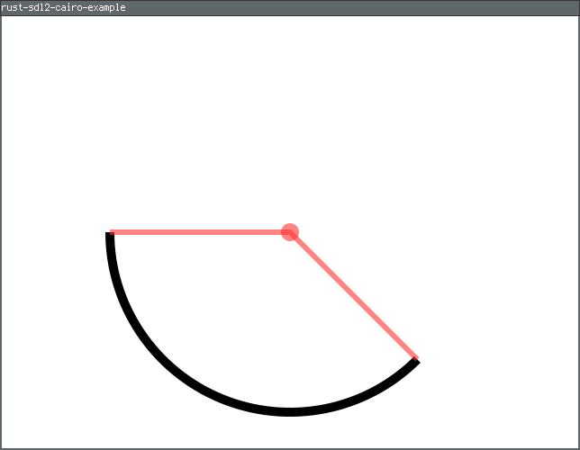

# rust-sdl2-cairo-example
A simple SDL2 and cairo example ported from: https://github.com/tsuu32/sdl2-cairo-example

## Build and run
```sh
cargo run
```

## Screenshot


## Helpful Links
- https://cairographics.org/SDL/
- https://cairographics.org/samples/
- https://docs.rs/sdl2/latest/sdl2/
- https://gtk-rs.org/gtk-rs-core/stable/latest/docs/cairo/index.html

